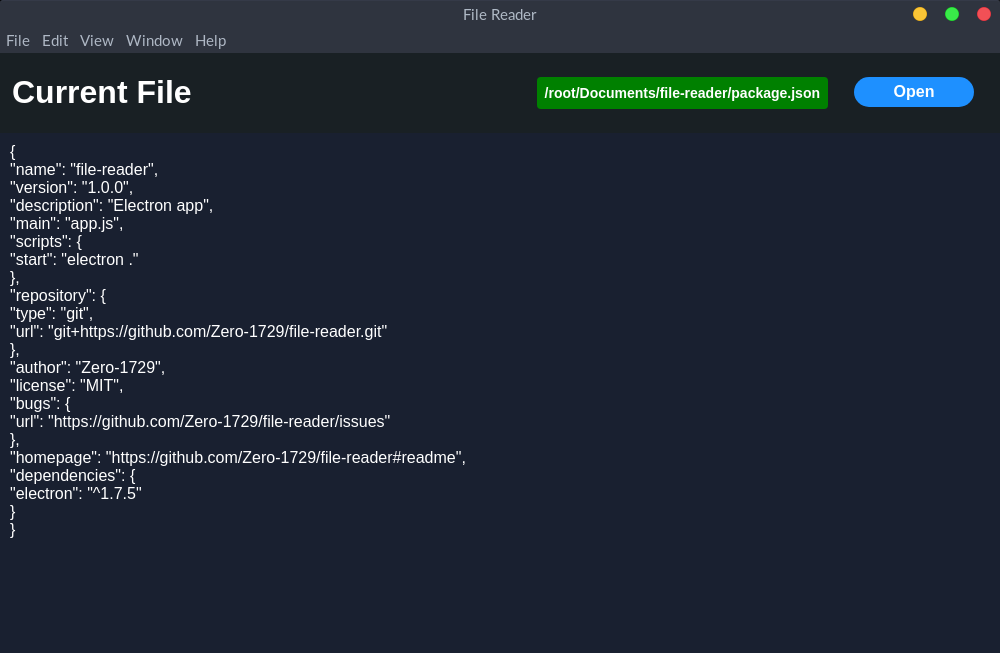

# Electron File Reader

---



An Example Electron App that Reads Files

## Features:
+ Minimal Interface
+ Sleep Blocker
+ Supported File Formats:
    + .txt
    + .css
    + .js
    + .html
    + .vue
    + .json
    + .py
    + .c


### Run app

> Make sure you have Git & NodeJs installed

```sh
# Clone Repo
$ git clone https://github.com/Zero-1729/file-reader

# Change into repo and install deps
$ cd file-reader && npm install

# Run electron
npm start
```

---

MIT &copy; Zero-1729
